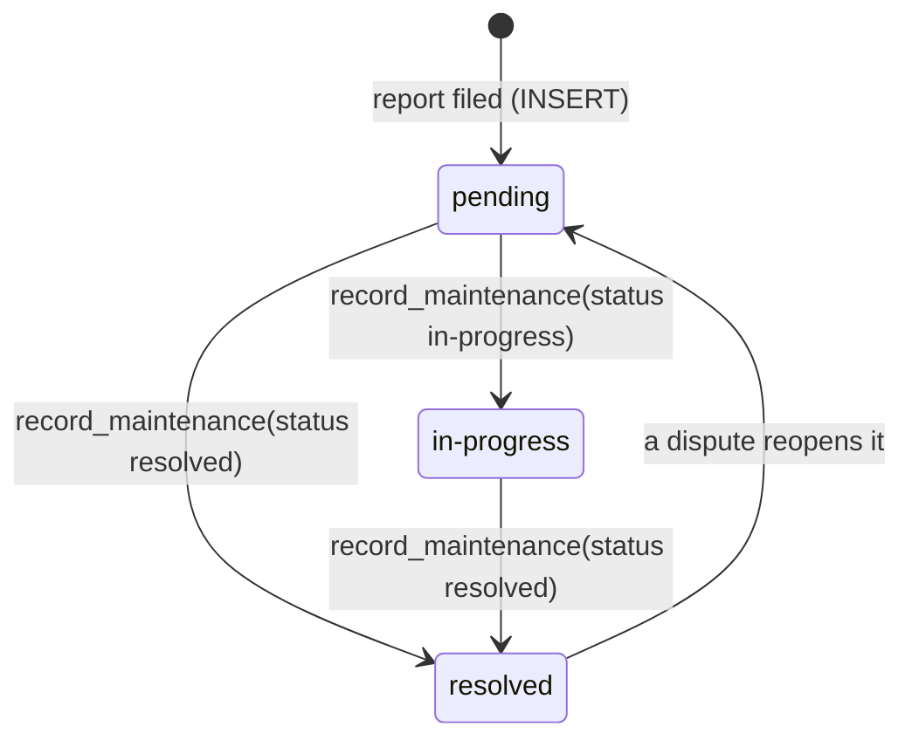
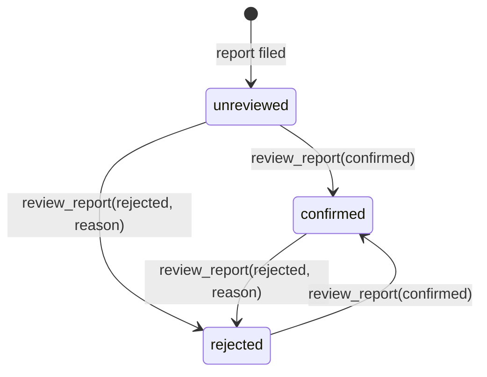
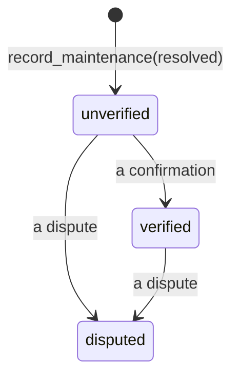

# Report lifecycle

A citizen report carries two independent states, and the maintenance that
closes it carries a third. This page says which function moves each one. The
functions are in `supabase/schemas/schema.sql` (`record_maintenance`) and
`supabase/schemas/schema_trust.sql` (the rest); nothing else can change these
columns, because clients have no UPDATE privilege on either table.

## 1. Where the work is: `reports.status`

- A new report must arrive as `pending` (the insert policy refuses anything
  else). Before it is saved, `check_report_submission` applies the duplicate
  and rate limits and measures the photo against the component.
- `record_maintenance` moves every open report on the component at once:
  work in progress takes `pending` to `in-progress`; finished work takes both
  to `resolved` and links the report to the maintenance record
  (`resolved_by_maintenance_id`, `resolved_at`, `resolved_image`). Reports
  staff rejected are skipped.
- A dispute (section 3) sends `resolved` reports back to `pending` and
  clears the link: all of them for a staff dispute, only the reporter's own
  for a reporter's.

## 2. Is the report real: `reports.review_status`

- Only agency staff can call `review_report`. A rejection needs a reason
  (`review_note`); staff may also correct the priority.
- A rejected report drops out of every public list, count, map pin and
  dashboard figure, and out of the validation script. Staff can still see it
  (the reports tab's "Show reports staff rejected") and undo it.
- `photo_check` (`match` within 100 m, `mismatch`, `missing`) is set once,
  when the report is filed, from the photo's EXIF. It helps staff decide; it
  never changes the report's state by itself.

## 3. Was the fix real: `maintenance.verification_status`

- The person who did the work can't vouch for it. A confirmation or dispute
  comes from another staff member (`review_maintenance`) or from a citizen
  whose report it closed (`respond_to_resolution`, within 30 days). A
  dispute has to say what is still wrong.
- Each review is a row in `maintenance_reviews`; the status is recomputed
  from them (`private.refresh_verification`): any dispute makes it
  `disputed`, otherwise any confirmation makes it `verified`.
- A dispute reopens reports (section 1). The dashboard counts fixes as
  "verified" only when someone other than the crew confirmed them.

## Who can do what

| Action                    | Function                | Allowed                                                                     |
| ------------------------- | ----------------------- | --------------------------------------------------------------------------- |
| File a report             | INSERT on `reports`     | anyone, within the rate limits                                              |
| Confirm / reject a report | `review_report`         | agency staff                                                                |
| Record work               | `record_maintenance`    | agency staff                                                                |
| Confirm / dispute work    | `review_maintenance`    | agency staff other than the crew                                            |
| "Is it fixed?"            | `respond_to_resolution` | the reporter, for their own report, within 30 days of it being marked fixed |
